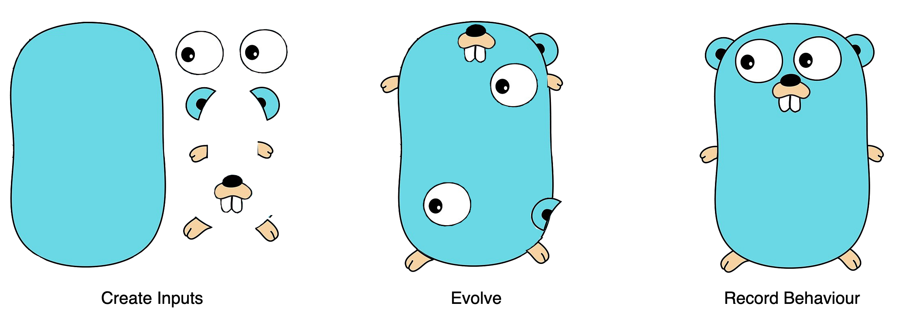

<p align="center">

</p>

# Final Unit
[](https://github.com/wimspaargaren/final-unit/actions)

Final Unit is a command line tool to automatically generate unit test cases for your Go source code. It uses evolutionary based machine learning in order to try and create a test suite with the highest coverage it can find.

## Getting started

Currently Final Unit relies on goimports. Make sure it's installed on your system:
```bash
$ go get golang.org/x/tools/cmd/goimports
```

### Download latest release

Download the [latest release](https://github.com/wimspaargaren/final-unit/releases/latest).

### Install Dev version

Make sure go binaries are available in your terminal
```bash
export PATH=$PATH:$GOPATH/bin
```
Install the dev version:
```bash
$ go install github.com/wimspaargaren/final-unit/cmd/finalunit@latest
```

## Usage

Warning: FinalUnit reads and executes your code. Make sure no unintentional behaviour can occur.

List of available flags
```
Usage of finalunit:
  -d string
        dir for which to execute the generator (default ".")
  -debug
        run generator in debug mode
  -no-improve-gens int
        max amount of generations without improvements before the generator halts (default 10)
  -org-amount int
        amount of organisms in the population (default 10)
  -target-fitness int
        number between 0 and 100 indicating the target coverage we try to hit (default 95)
  -test-cases-func int
        amount of test cases created for every function (default 10)
  -v    run generator in verbose mode
  -version
        current version
```

Open a folder containing source code in your terminal. Execute:
```bash
$ finalunit -v
```

## Decorators

Decorators are used to control unit test generation behaviour. Using the decorator file, it is possible to exclude functions and files from generation. Furthermore, decorators can be used to add custom functions to generate input values used for unit test generation. The generator will look for a yaml file called evo.yaml located in the current directory. An example decorator specification is shown below.

### Example
An example `evo.yaml` file is shown below
```yaml
custom_vals: evo_test.go
files:
- name: myfile.go
    funcs:
    - name: SomeFunc
        receiver_values: [customReceiverVal]
        params:
        - name: x
            values: [CustomValueForParamX,OtherValueForParamX]
        - name: y
            values: [CustomValueForParamY]
    - name: IgnoreFunc
        ignore: true
```
### Decorator Spec

The decorator specification can be used to create decorators for files in a given directory.

|Field|Type|Description|Required|
|--- |--- |--- |--- |
|custom_vals|String|File path to the go file containing custom values.|No|
|files|[[]FileSpec](#decorator-file-spec)|Decorator specification for files.|No|

### Decorator File Spec

The file decorator can be used to create custom decorators for a given file.

|Field|Type|Description|Required|
|--- |--- |--- |--- |
|name|String|Name of file on which the decorator is applied.|Yes|
|ignore|Bool|Boolean indicating if the generator should exclude this file from generation. If any additional function decorator specs are defined, they are ignored.|No|
|funcs|[[]FuncSpec](#decorator-func-spec)|Decorator specification for functions|No|

### Decorator Func Spec

The function decorator provides the possibility to define custom values for the receiver type and or parameters of a function. Furthermore, the decorator can be used to ignore a given function.

|Field|Type|Description|Required|
|--- |--- |--- |--- |
|name|String|Name of file on which the decorator is applied.|Yes|
|ignore|Bool|Boolean indicating if the generator should exclude this function from generation. If true any additional specifications will be ignored for this function.|No|
|receiver_values|[]String|Decorator specifying functions having custom values for the receiver type of a function. The return type of the function should be equal to the function receiver type.|No|
|params|[[]ParamSpec](#decorator-param-spec)|Decorator specification for function parameters.|No|

### Decorator Param Spec

The parameter decorator specification provides the option to add a list of function names, which return user defined values which can be used as input values in order to create unit tests.

|Field|Type|Description|Required|
|--- |--- |--- |--- |
|name|String|Name of the parameter on which the decorator is applied.|Yes|
|values|[]String|Decorator specifying functions having custom values for the specified parameter of a function. The return type of the function should be equal to the parameter type.|No|
